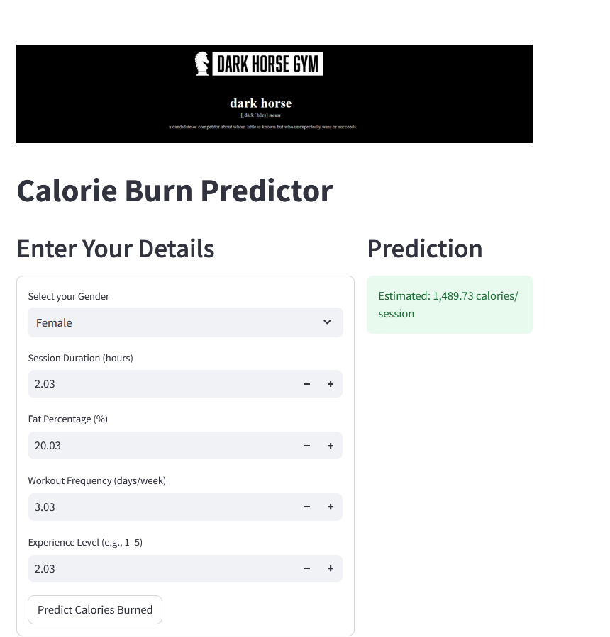

# Predicting-calories-burned

## I developed a model to predict the number of calories burned after a gym session using Linear Regression. The model's performance was evaluated using the Root Mean Squared Error (RMSE), which was found to be 101, and an Adjusted R-squared of 0.85.

## The front-end interface was created with Streamlit and deployed on the Streamlit Community Cloud for easy interaction and sharing. You can try out the model using the following link:

## https://caloryprediction.streamlit.app/
