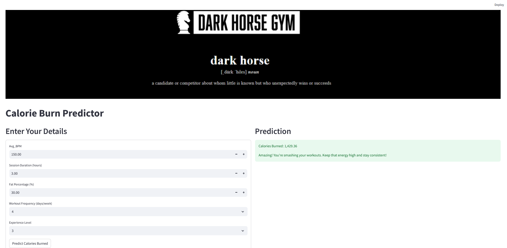

# Calories Burn Predictor

## project demo link - https://caloryprediction.streamlit.app/

calories burn prediction involves estimating the number of calories likely to be burned during a gym session based on user input such as gender, session duration, workout frequency and Fat percentage. This is a critical tool for gyms aiming to motivate new clients and retain existing ones by giving personalized insights into their fitness journey.

**Why Is It Important?**

For most individuals joining a gym, calorie burn is a primary goal. From a business perspective, providing potential and current clients with realistic and personalized projections can serve as a powerful motivator. It can also enhance client acquisition by setting clear, data-backed expectations.

**About the Dataset**  
The dataset contains 963 records and 15 features, representing both past and current gym clients. The goal is to predict the number of calories burned in a single session, which helps the business in:  
Personalizing client experiences  
Boosting client motivation  
Enhancing client retention and onboarding strategies  

**Steps Involved in Model development & Deployment**  
Exploratory Data Analysis (EDA)  
Data Preprocessing  
Feature Engineering  
Feature Selection using statistical tests  
Model Training with Linear Regression  
Hyperparameter Tuning using RandomizedSearchCV  
Model Serialization with Pickle  
Web Application Development using Streamlit  
Deployment on Streamlit Community Cloud  

**Packages Used**  
This project uses Python and the following libraries:  
numpy  
pandas  
matplotlib  
seaborn  
scikit-learn  
scipy  
streamlit  
pickle  

**Project Objective**  
To build a Linear Regression model that accurately predicts the calories burned during a gym session based on client input.

Project Demo Link - [Click Here](https://calorypredictor.streamlit.app/)

